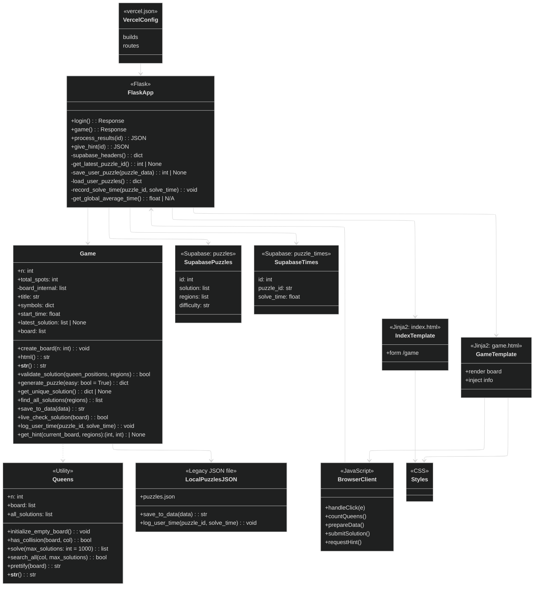

# Queens: A Flask-powered N-Queens puzzle generator and solver
## Live Demo: https://queens-bay.vercel.app
## Rules
Based on LinkedIn Queens:
1. Each row, column, and colored region must contain exactly one Crown symbol (Queen).
2. Crown symbols cannot be placed in adjacent cells, including diagonally.
3. Click or tap on cells to toggle between empty cells, marked (bolded box) symbol, and Crown symbol.

## Features
- Procedurally generated LinkedIn Queens puzzles  
- Region-based N-Queens constraints  
- Auto-validation engine  
- Supabase integration for puzzle storage and stats  
- Hint engine powered by solution backtracking  

## Tech Stack
- Frontend: HTML/CSS, vanilla JS
- Backend: Flask (Python), REST endpoints
- Database: Supabase (Postgres) via REST API
- Deployment: Vercel (frontend)

## Sample Gameplay
Creating a new puzzle:

Placing queens and marking feature:

Getting a hint: 

Sample win scenario:

Sample loss scenario:

